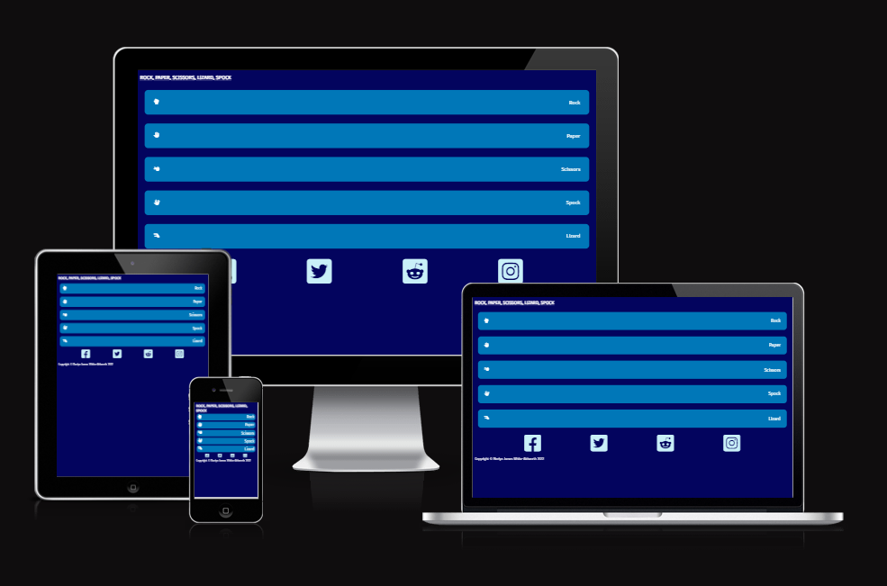
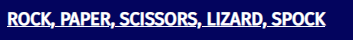
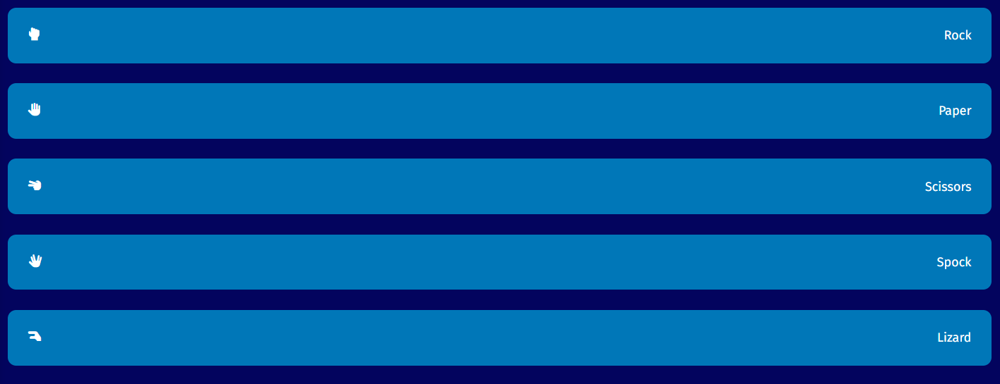
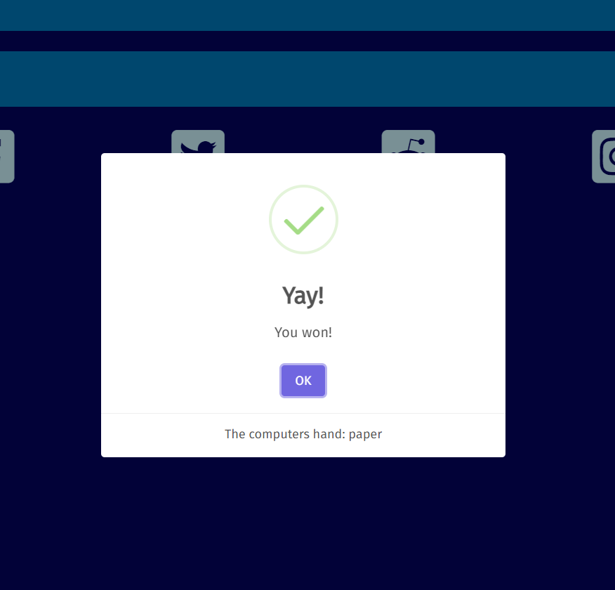
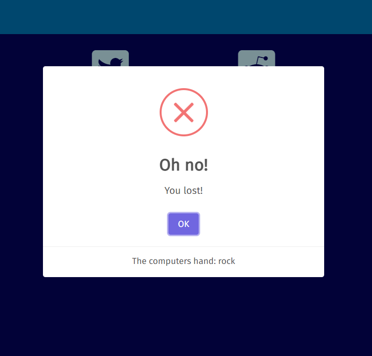
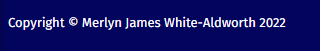

# Rock-Paper-Scissors-Lizard-Spock

Rock, Paper, Scissors, Lizard, Spock is a game for those who like playing Rock, Paper, Scissors but want to change it up a little.

This site allows people to play Rock, Paper, Scissors, Lizard, Spock against their computer.

## Features

### Existing Features

* Page's title

  The title serves to confirm to the user that they are at the right page and of the page's purpose.

* Hand selection buttons

  The selection buttons are the player's input to be able to make their choice of hand.

* Result alert

  The result alerts serve as the player's feedback for the result of the game.

  The alert given a win condition.

  The alert given a draw condition.

  The alert given a loss.

* Social media links

  The social media links serve as a form of self-promotion to allow interested users to follow the author's work.

* Copyright mark

  The copyright mark serves to remind viewers of the author's identity as well as assist with the legal protection of their work.

## Credits

* Font Awesome

  The site uses icons provided by Font Awesome.
  The use of these icons is provided under Font Awesome's [free license](https://fontawesome.com/license/free). All copyright for the icons is attributable to Fonticons, Inc.

* Sweetalert

  I'm using [Sweetalert](https://github.com/sweetalert2/sweetalert2)'s library to display an alert to the user after they've selected a hand, informing them of the result of the game.
  Their license can be found [here](https://github.com/sweetalert2/sweetalert2/blob/main/LICENSE)

* Google Fonts

  The site uses Fira Sans, provided by Google Fonts.
  Fira Sans is provided under the [SIL Open Fonts license](https://scripts.sil.org/cms/scripts/page.php?site_id=nrsi&id=OFL)
