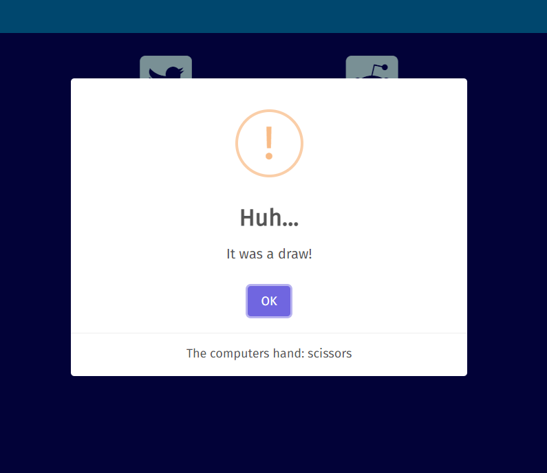

# Rock-Paper-Scissors-Lizard-Spock

Rock, Paper, Scissors, Lizard, Spock is a game for those who like playing Rock, Paper, Scissors but want to change it up a little.

This site allows people to play Rock, Paper, Scissors, Lizard, Spock against their computer.

## Features

### Existing Features

* Page's title

  The title serves to confirm to the user that they are at the right page and of the page's purpose.

* Hand selection buttons

  The selection buttons are the player's input to be able to make their choice of hand.

* Result alert

  The result alerts serve as the player's feedback for the result of the game.

  The alert given a win condition.

  The alert given a draw condition.

  The alert given a loss.

* Social media links

  The social media links serve as a form of self-promotion to allow interested users to follow the author's work.

* Copyright mark

  The copyright mark serves to remind viewers of the author's identity as well as assist with the legal protection of their work.

### Features Left to Implement

* An alert giving the game rules
* Allow the user to play against fellow human players as well as their computer
* Have the site change its layout for screen widths greater than 768px

## Testing

I have run my site through lighthouse and received the following results:

  * Mobile:
  
  

  * Desktop:

  

I checked my Javascript code by console logging out the values of each function's inputs and output to make sure that they matched the values which I expected.

### Validator Testing

* HTML

  * The W3C Validator found [no errors](https://validator.w3.org/nu/?doc=https%3A%2F%2Fmerlynjwa.github.io%2FRock-Paper-Scissors-Lizard-Spock%2F)

* CSS

  * Jigsaw found [no errors](https://jigsaw.w3.org/css-validator/validator?uri=https%3A%2F%2Fmerlynjwa.github.io%2FRock-Paper-Scissors-Lizard-Spock%2F&profile=css3svg&usermedium=all&warning=1&vextwarning=&lang=en)

* Javascript

  * No errors were found by Jshint
  
    The following metrics were given:
    
      * There are 4 functions in this file.

      * Function with the largest signature take 2 arguments, while the median is 0.5.

      * Largest function has 9 statements in it, while the median is 3.

      * The most complex function has a cyclomatic complexity value of 3 while the median is 2.

    Jshint gave one warning:

      * `89	Functions declared within loops referencing an outer scoped variable may lead to confusing semantics. (displayResult, hand)`

    My code has one undefined variable:

      * `56	Swal`
      * `65	Swal`
      * `74	Swal`

### Bugs

#### Unfixed Bugs

There are no unfixed bugs that I'm aware of.

#### Fixed Bugs

I had an issue with my code only giving the loss condition. This was due to an inconsistency between the type which my `compareHands` function expected the input hand to be and the type I was passing it.

I was passing it a string when it expected an object containing a string and an array of strings.

## Credits

* Font Awesome

  The site uses icons provided by Font Awesome.
  The use of these icons is provided under Font Awesome's [free license](https://fontawesome.com/license/free). All copyright for the icons is attributable to Fonticons, Inc.

* Sweetalert

  I'm using [Sweetalert](https://github.com/sweetalert2/sweetalert2)'s library to display an alert to the user after they've selected a hand, informing them of the result of the game.
  Their license can be found [here](https://github.com/sweetalert2/sweetalert2/blob/main/LICENSE)

* Google Fonts

  The site uses Fira Sans, provided by Google Fonts.
  Fira Sans is provided under the [SIL Open Fonts license](https://scripts.sil.org/cms/scripts/page.php?site_id=nrsi&id=OFL)
